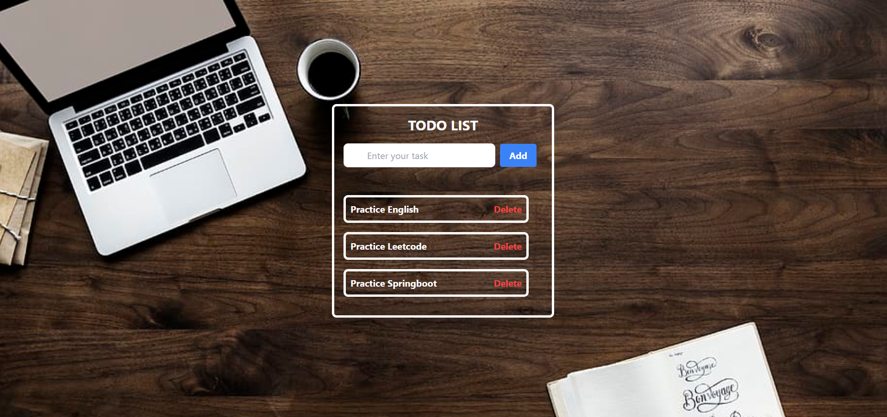

<div align="center">

# ✅ REACT TODO APP
### *Streamlined Task Management with Tailwind CSS*

[](https://react.dev/)
[](https://tailwindcss.com/)
[](https://vitejs.dev/)

**A clean, minimalist productivity tool for modern web users.**

---

</div>

## 📖 Overview
The **React Todo App** is a demonstration of modern frontend development practices. It utilizes **React Functional Components** and **Hooks** to manage state, while **Tailwind CSS** provides a highly responsive and aesthetic utility-first design.

---

## 📸 Interface Preview


---

## ✨ Key Features
* **💾 Data Persistence:** Uses `localStorage` to ensure tasks are saved after browser refreshes.
* **📱 Responsive Design:** Fully optimized for Desktop, Tablet, and Mobile screens.
* **⚡ Real-time Updates:** Instant UI feedback when adding, completing, or deleting tasks.
* **🎨 Modern UI/UX:** Clean typography and subtle transitions for a premium feel.

---

## 💻 Tech Stack
| Component | Technology |
| :--- | :--- |
| **Library** | React 18 |
| **Styling** | Tailwind CSS |
| **State Management** | React Hooks (`useState`, `useEffect`) |
| **Storage** | Browser LocalStorage |

---

## 🚦 Getting Started

### Prerequisites
* **Node.js** (v16.x or higher)
* **npm** or **yarn**

### Installation & Setup

1.  **Clone the repository:**
    ```bash
    git clone [https://github.com/faizal08/todo-app-react-tailwind.git](https://github.com/faizal08/todo-app-react-tailwind.git)
    ```

2.  **Navigate to the directory:**
    ```bash
    cd todo-app-react-tailwind
    ```

3.  **Install dependencies:**
    ```bash
    npm install
    ```

4.  **Start the development server:**
    ```bash
    npm run dev
    ```

---

## 🚀 Usage
1. Open your web browser.
2. Navigate to: `http://localhost:5173/`

---

## 📩 Contact
For any inquiries or feedback, feel free to reach out:

* **Email:** [reachfaizal08@gmail.com](mailto:reachfaizal08@gmail.com)
* **GitHub:** [@faizal08](https://github.com/faizal08)
   
